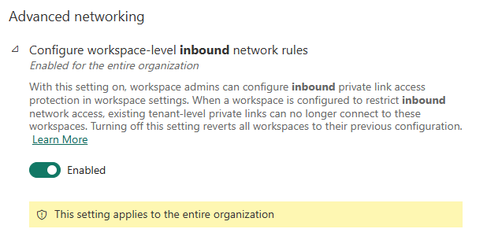

# MSFabric-private-workspace

## Objectives

Secure the Inbound access of a Microsoft Fabric Workspace with Azure Private Link and Azure Networking private endpoints.

Link to Microsoft documentation :
<https://learn.microsoft.com/en-us/fabric/security/security-workspace-level-private-links-overview>

Verify the following prerequisites
<https://learn.microsoft.com/en-us/fabric/security/security-workspace-level-private-links-set-up#prerequisites>

## Configure MS Fabric Tenant

To can configure inbound private link access protection in workspace settings, you have to authorize this action in Fabric Tenant Admin Portal.
In "Tenant Settings", look at "Configure workspace-level inbound network rules" (in Advanced Networking section)

