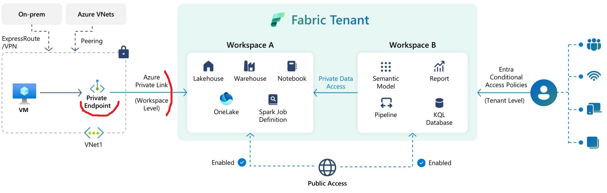

# MSFabric-private-workspace


## Objectives

Secure the Inbound access of a Microsoft Fabric Workspace with Azure Private Link and Azure Networking private endpoints.

Link to Microsoft documentation :
[https://learn.microsoft.com/en-us/fabric/security/security-workspace-level-private-links-overview](https://learn.microsoft.com/en-us/fabric/security/security-workspace-level-private-links-overview)

Verify the following prerequisites
[https://learn.microsoft.com/en-us/fabric/security/security-workspace-level-private-links-set-up#prerequisites](https://learn.microsoft.com/en-us/fabric/security/security-workspace-level-private-links-set-up#prerequisites)

## Configure MS Fabric Tenant

To can configure inbound private link access protection in workspace settings, you have to authorize this action in Fabric Tenant Admin Portal.
In "Tenant Settings", look at "Configure workspace-level inbound network rules" (in Advanced Networking section)


## Create Private Link service for Fabric for Workspace

You have to choose the private link you want to secure.

You need to capture, **your tenant ID**, and your **workspace ID**.

### Tenant ID

Method in Fabric Portal:

- Open the Microsoft Fabric portal
- Click the question mark icon (?) in the top-right corner.
- Select “About Fabric”.
- Look for the Tenant URL — your Tenant ID is the value of the`ctid` parameter in that URL.

Simpler method with Azure Portal, go to Entra ID.

### Workspace ID

From your Fabric portal URL

"https://app.fabric.microsoft.com/groups/`2983gbr-51e6-4687-b036-e5f4b42b3e3c`/list?experience=fabric-developer)

Note : the Worspace ID is split into 5 groups separated by hyphens, following the standard UUID/GUID representation. Web app URLs use the standard GUID notation, so the portal shows it with hyphens for readability and consistency with API responses. (8-4-4-4-12). DNS hostnames can’t contain hyphens in certain positions that would break the label structure, so Microsoft strips them out when embedding the GUID into the FQDN for the data‑plane endpoint.
Your Workspace ID will be : `2983gbr51e64687b036e5f4b42b3e3c`

Now it's time to create your private Endpoint for your MS Fabric Workspace

Look at the MS documentation for that:

[Set up and use workspace-level private links - Microsoft Fabric | Microsoft Learn](https://learn.microsoft.com/en-us/fabric/security/security-workspace-level-private-links-set-up#step-3-create-a-virtual-network)

You created a `microsoft.fabric/privatelinkservicesforfabric`

To check go with Azure portal on the Ressource "Azure Resource Graph Explore", and execute the following query:

```
resources 
| where type =~ "Microsoft.Fabric/privateLinkServicesForFabric" 
| project id, name, type, location
```


Now it's time to create the infrastructure to implement your private endpoint to access to you Worksapce through the Fabric Private Link

[Create a Virtual Network](https://learn.microsoft.com/en-us/fabric/security/security-workspace-level-private-links-set-up#step-3-create-a-virtual-network)

[Create a VM](https://learn.microsoft.com/en-us/fabric/security/security-workspace-level-private-links-set-up#step-4-create-a-virtual-machine)

[Create a Private Endpoint](https://learn.microsoft.com/en-us/fabric/security/security-workspace-level-private-links-set-up#step-5-create-a-private-endpoint)

Now you will have something like this schema




* A Private Link connected to your MS Fabric Workspace.
* A Private Endpoint in your VNet linked to the Private Link.

Warning: If your VM has a public IP, verify the VNet Link exist for the `Private DNS` created with during private link setup.

In azure portal go to "Private DNS zones


Now we have all the elements to establish a private (non public) connexion from the VM to your Microsoft Fabric Workspace.

We are going to verify:
